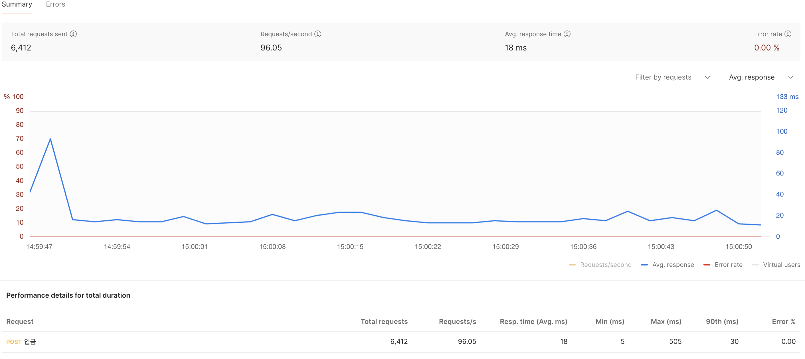
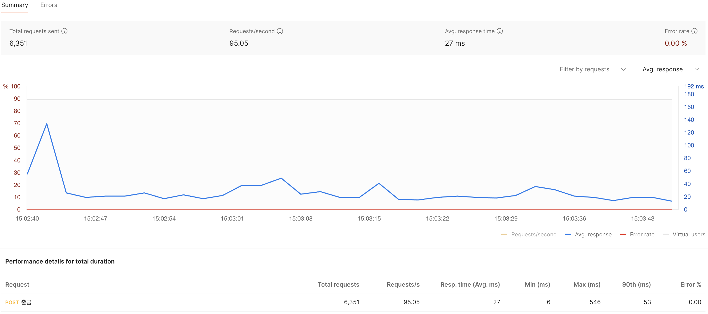
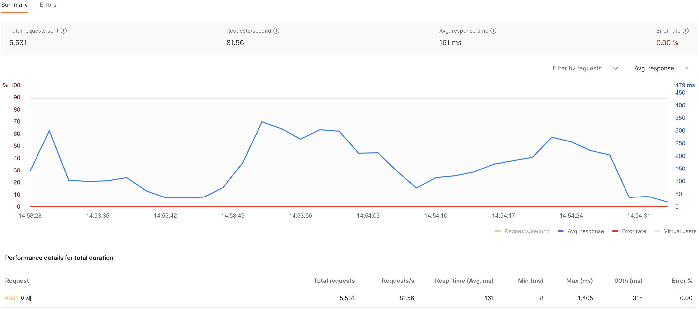

## Banking Application

계좌 간 송금 시스템을 설계하고 구현하였습니다.

시스템은 계좌의 개설과 해지, 입금, 출금, 이체, 거래내역 조회 API 를 제공합니다. 

## 사용 기술

- [X] Java 17
- [X] Spring Boot 3.4.4
- [X] Spring Data JPA
- [X] QueryDSL
- [X] MySQL
- [X] Redis
- [X] Docker, Docker Compose 

## API 

API 에 대한 자세한 명세와 호출 테스트는 프로젝트 실행 후 [Swagger](http://localhost:8080/swagger-ui.html) 를 통해 확인할 수 있습니다. 

### 계좌 개설 

```http request
POST /api/v1/accounts
```
### 계좌 해지 

```http request
DELETE /api/v1/accounts
```

### 입금 

```http request
POST /api/v1/deposits
```

### 출금

```http request
POST /api/v1/withdrawals
```

### 이체 

```http request
POST /api/v1/transfers
```

### 계좌 거래내역 조회 

목록 조회 시 처음 호출에서는 cursor 값을 비워서 호출하고, 두번째 조회 부터 응답값의 nextCursor 값을 입력하여 호출

```http request
GET /api/v1/accounts/{accountNo}/transactions?cursor=&size=10
```

## 프로젝트 설명  

### 패키지 구조 

```text
- main.java.com.jskim.banking
  - advice : exception handler (API 요청에 대한 예외 핸들러로 업무적으로 처리된 예외와 에러를 구분)
  - annotation : 프로젝트에서 사용 가능한 custom annotation
  - aop : 비즈니스 로직과 별개로 수행할 공통 기능 AOP  
  - config : 설정 (QueryDsl, Redisson)    
  - controller
  - data
    - code : 비즈니스 로직에서 코드로 정의 될 수 있는 enum   
    - converter : enum 과 db code 값을 다르게 저장할 경우 사용하는 변환 클래스
    - entity 
    - repository 
  - exception : 업무 예외 정의 
  - policy : 견고한 도메인 로직(ex:출금 시 잔액 확인)이 아닌 변화가 생길 수 있는 정책적인 비즈니스 로직을 업무별 정책 클래스로 나누어 분리
    - Constant : 프로젝트의 상수값을 관리  
  - request : 클라이언트에서 서버로 데이터 요청 객체 
  - response : 서버에서 클라이언트로 데이터 응답 객체 
  - service 
  - util  
- test.java.com.jskim.banking
  - data
  - policy
  - util 
```

### 프로젝트 코드 및 구조 설명 (+추가 고려사항) 

- 서비스 레이어는 가급적 단순한 메서드의 호출, 데이터 조회 및 저장만을 수행하도록 하였습니다. 
- 구체적인 비즈니스 로직은 도메인 객체나 정책 클래스를 통해 구현하였습니다. 
- 테스트 코드는 비즈니스 로직을 담당하는 도메인 객체와 정책 클래스 위주로 작성하였습니다. 
- 동시성 문제를 해결하기 위해 분산 락을 사용하였고, 비즈니스 로직과 분리하기 위해 AOP 로 구현하였습니다.  
  - Redis 환경에서의 문제 발생 또는 개발자의 분산 락 적용 실수 등에 대비하여 추가적인 안정성을 확보하기 위해 별도의 낙관적 락을 적용하였습니다. 
    - 동시성에 문제가 발생했을 때 치명적일 수 있는, Account 엔티티와 DailyAccountUsage 엔티티에 @Version 을 통해 낙관적 락을 적용하였습니다.
  - 다중 키에 대해 락을 설정할 때, 데드락을 방지하기 위해 키를 정렬하여 항상 일관된 순서로 락을 설정하였습니다.
- 목록 조회 시 중복된 데이터가 출력되지 않도록 하기 위해 Cursor 기반의 Pagination 을 적용하였습니다. 
- 계좌 번호 생성은 숫자로 구성된 13자리 문자열을 랜덤하게 생성하도록 구현하였습니다. 
  - 계좌 번호 충돌의 비율을 모니터링할 필요가 있습니다.
  - 만약, 충돌을 제한해야 한다면 시퀀셜하게 Redis 의 원자적 증분을 이용하여 중복되지 않는 계좌번호 생성이 가능합니다.
  - 계좌 번호에 업무적인 패턴이 있다면 수정이 필요합니다. 
- 코드를 보다 간결하게 유지하는 것에 중점을 두어 업무적으로 의미있는 이름의 메서드를 이용하여 더티 체킹으로 변경된 값을 저장하도록 하였습니다.  
  - 데이터 갱신 시 명시적으로 호출하는 것이 필요한 환경이라면, 엔티티를 불변객체로 사용하는 것을 고민해 볼 수 있습니다.
- 계좌 해지에서 계좌 정보 데이터에 대한 하드 삭제가 아닌 소프트 삭제를 사용하였습니다.
- 수수료 정책 구체화 
  - 수수료 계산 시 소수점에 대한 처리 기준이 필요합니다. (반올림을 적용하였습니다.)
  - 이체 가능한 최소 금액 또는 수수료 최소 금액에 대한 기준이 필요합니다. 
- 기술적으로 개선해 볼 만한 항목으로 동일한 요청에 대해 이중 요청 방지
  - 클라이언트 사이드에서 디바운싱 처리를 통해 개선가능합니다.
  - 서버 사이드에서 출금, 입금, 이체 처리에서 멱등키 적용해 볼 수 있습니다.

## 성능 테스트 

성능 테스트는 가상 사용자 100명으로 1분간 진행하였습니다. 에러율이 0%로 실행에 이상 없음을 확인했습니다.

이 테스트는 로컬 환경이므로 실제 환경과 유사한 조건에서 테스트가 필요합니다. (테스트 후 수치적으로 시스템의 성능을 확인하여 시스템 설계에 참고할 수 있습니다.) 

### [입금 테스트] 



### [출금 테스트]



### [이체 테스트]



## 개발환경 설정

### Code Style 설정

Java 코드 스타일을 맞추기 위해 `intellij-java-google-style.xml` 적용

IntelliJ 적용 방법 : Settings -> Editor -> Code Style -> Java -> Import Scheme (`./intellij-java-google-style.xml` 경로의 xml import)

### Docker 설정

로컬환경에 Docker 가 설치되어 있지 않으면 [Docker](https://www.docker.com/) 공식 사이트에서 다운로드받아 설치할 수 있습니다.  
설치 완료 후 아래 Command 를 이용하시면 됩니다.

#### 서비스 시작:

```bash
docker-compose -f ./docker-compose.yml up -d
```

#### 서비스 중지:

```bash
docker-compose -f ./docker-compose.yml down
```

#### 서비스 상태 확인:

```bash
docker-compose -f ./docker-compose.yml ps
```

#### 로그 확인:

```bash
docker-compose -f ./docker-compose.yml logs [서비스이름]
```

### 프로젝트 실행 방법

```shell
# 실행 방법 1
./gradlew bootJar
# jar 필드 후 실행 
java -jar ./build/libs/banking-0.0.1-SNAPSHOT.jar
```

```shell
# 실행 방법 2
./gradlew bootRun
```
